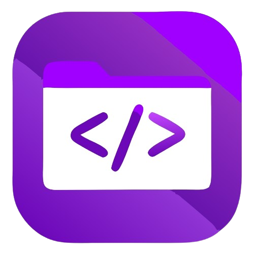

# LazyStack

<div align="center">
  
  <p><em>The Ultimate Developer Tools Collection</em></p>
  
  
  
  
  
  [](https://opensource.org/licenses/MIT)
</div>

## 🚀 Overview

LazyStack is a modern web platform showcasing curated developer tools, focusing on AI-powered development solutions, design resources, and programming utilities. The site features a sleek, responsive interface with dynamic animations and comprehensive tool listings to help developers discover and access the best resources for their workflow.

## ✨ Features

- **AI Development Tools** - Discover cutting-edge AI-powered tools like Cursor AI, GitHub Copilot, and Devin AI
- **Design & UI Resources** - Explore professional design tools for creating stunning user interfaces
- **Programming & Development Utilities** - Access essential tools for efficient programming and development
- **Modern UI/UX** - Enjoy a responsive design with smooth animations and intuitive navigation
- **Dark Mode Support** - Switch between light and dark themes for comfortable viewing

## 🛠️ Tech Stack

- **Framework**: Next.js 14
- **Language**: TypeScript
- **Styling**: Tailwind CSS
- **UI Components**: Radix UI
- **Animations**: GSAP
- **State Management**: React Hooks
- **Backend Integration**: Supabase

## 🏃‍♂️ Getting Started

### Prerequisites

- Node.js 18+ and npm/yarn

### Installation

1. Clone the repository:

   ```bash
   git clone https://github.com/znarf-y/LazyStack.git
   cd LazyStack
   ```

2. Install dependencies:

   ```bash
   npm install
   # or
   yarn install
   ```

3. Run the development server:

   ```bash
   npm run dev
   # or
   yarn dev
   ```

4. Open [http://localhost:3000](http://localhost:3000) in your browser.

## 📂 Project Structure

```
lazystack/
├── public/            # Static assets
├── src/
│   ├── app/           # Next.js app router
│   ├── components/    # React components
│   │   ├── ui/        # UI components
│   │   └── ...        # Feature components
│   └── lib/           # Utility functions and shared code
├── .next/             # Next.js build output
├── node_modules/      # Dependencies
└── ...                # Config files
```

## 🧩 Key Components

- **HeroSection** - Dynamic, animated hero section with cursor effects
- **ToolCategorySection** - Showcases different categories of developer tools
- **ToolCard** - Individual tool display with details and links
- **Navbar** - Responsive navigation with theme switcher
- **Footer** - Site information and additional links

## 🎨 Customization

### Adding New Tools

To add new tools to the collection, edit the appropriate array in `src/app/page.tsx`:

```typescript
const newTool = {
  title: "Tool Name",
  description: "Tool description",
  imageIcon: "/assets/images/tool-icon.png",
  category: "Category",
  highlight: "Highlight Feature",
  tryNowLink: "https://tool-url.com/",
};

// Add to appropriate array
aiTools.push(newTool);
```

### Styling

The project uses Tailwind CSS for styling. Global styles are defined in `src/app/globals.css`.

## 📝 License

This project is licensed under the MIT License - see the LICENSE file for details.

## 👥 Contributing

Contributions are welcome! Please feel free to submit a Pull Request.

1. Fork the repository
2. Create your feature branch (`git checkout -b feature/amazing-feature`)
3. Commit your changes (`git commit -m 'Add some amazing feature'`)
4. Push to the branch (`git push origin feature/amazing-feature`)
5. Open a Pull Request

## 📞 Contact

For questions or feedback, please open an issue or contact the maintainer.

## 👥 Developer/s

<table align="center">
  <tr>
    <td align="center">
      <b>akosikhada</b>
      <br />
      Frontend Developer, UI/UX Designer
    </td>
    <td align="center">
      <b>znarf-y</b>
      <br />
      Frontend Developer, UI/UX Designer
    </td>
  </tr>
</table>

---
