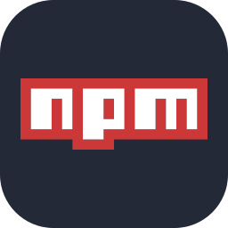

# LazyStack

<div align="center">
  
  <h3><i>"Developer's Treasure Trove"</i></h3>
  
  
  
  
  
  [](https://opensource.org/licenses/MIT)
</div>

## 🚀 Overview

LazyStack is a modern web platform showcasing a curated collection of developer tools, with a focus on AI-powered development solutions, design resources, and infrastructure utilities. The site features a sleek, responsive interface with interactive animations, dynamic content loading, and comprehensive tool listings organized by categories. Each tool is presented with detailed descriptions, benefits, and direct links, helping developers discover and access resources that can enhance their productivity and workflow.

## ✨ Features

- **AI Development Tools Collection** - Discover and explore cutting-edge AI-powered development tools with detailed descriptions and benefits
- **Design & UI Resources** - Curated collection of professional design tools for creating stunning user interfaces
- **Infrastructure & Deployment Tools** - Access essential tools for modern development infrastructure and deployment
- **Responsive Design** - Enjoy a mobile-friendly interface with smooth navigation and modern UI
- **Tool Categorization & Filtering** - Easily browse tools organized by category with detailed information
- **Modern UI with Animations** - Experience a sleek user interface with smooth transitions and visual effects

## 🛠️ Tech Stack

<div align="center">
  <table>
    <tbody>
      <tr>
        <td align="center"><br>CSS</td>
        <td align="center"><br>Tailwind CSS</td>
        <td align="center"><br>JavaScript</td>
        <td align="center"><br>React</td>
        <td align="center"><br>Next.js</td>
      </tr>
      <tr>
        <td align="center"><br>TypeScript</td>
        <td align="center"><br>Shadcn/ui</td>
        <td align="center"><br>Radix UI</td>
        <td align="center"><br>GSAP</td>
        <td align="center"><br>Supabase</td>
      </tr>
      <tr>
        <td align="center"><br>Git</td>
        <td align="center"><br>GitHub</td>
        <td align="center"><br>NPM</td>
        <td align="center"><br>VSCode</td>
        <td align="center"><br>Vercel</td>
      </tr>
    </tbody>
  </table>
</div>

## 🏃‍♂️ Getting Started

### Prerequisites

- Node.js 18+ and npm/yarn
- Git installed on your machine
- A modern web browser (Chrome, Firefox, Safari, or Edge)
- Basic knowledge of React and JavaScript
- (Optional) VS Code or another code editor with TypeScript support
- (Optional) Yarn for faster dependency installation

### Installation

1. Clone the repository:

   ```bash
   git clone https://github.com/znarf-y/LazyStack.git
   cd LazyStack
   ```

2. Install dependencies:

   ```bash
   npm install
   # or
   yarn install
   ```

3. Run the development server:

   ```bash
   npm run dev
   # or
   yarn dev
   ```

4. Open [http://localhost:3000](http://localhost:3000) in your browser.

## 📝 License

This project is licensed under the MIT License - see the LICENSE file for details.

## 👥 Contributing

Contributions are welcome! Please feel free to submit a Pull Request.

1. Fork the repository
2. Create your feature branch (`git checkout -b feature/amazing-feature`)
3. Commit your changes (`git commit -m 'Add some amazing feature'`)
4. Push to the branch (`git push origin feature/amazing-feature`)
5. Open a Pull Request

## 📞 Contact

For questions or feedback, please open an issue or contact the maintainer.

## 👥 Developer/s

<table align="center">
  <tr>
    <td align="center">
      <b>akosikhada</b>
      <br />
      Frontend Developer, UI/UX Designer
    </td>
    <td align="center">
      <b>znarf-y</b>
      <br />
      Frontend Developer, UI/UX Designer
    </td>
  </tr>
</table>

---
